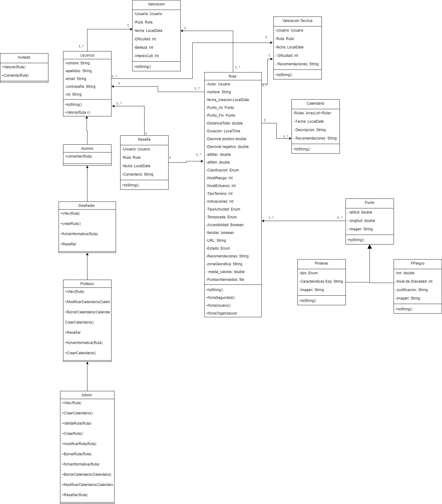
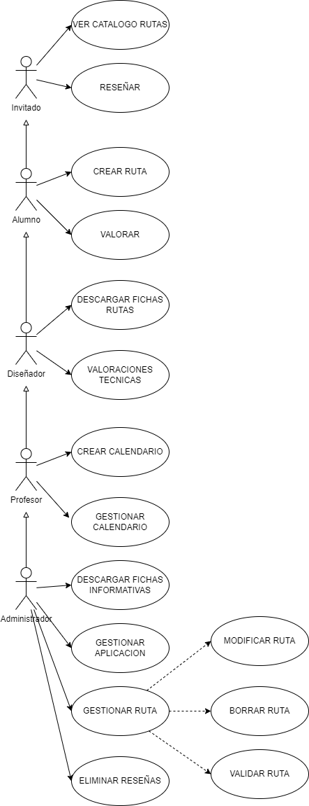

# DAM1_GRUPO4_2025

## Índice
1. [Descripción del Proyecto](#descripción-del-proyecto)
2. [Participantes](#participantes)
3. [Diagrama Entidad-Relación (E/R)](#diagrama-entidad-relación-er)
4. [Diagrama Relacional](#diagrama-relacional)
5. [Script](#script-bd)
6. [Diagrama de Clases](#diagrama-de-clases)
7. [Diagrama de Casos de Uso](#diagrama-de-casos-de-uso)
8. [Pagina Web](#pagina-web)
9. [XSLT](#xslt)
10. [Logica Educativa](#lógica-educativa-java)
11. [Script Triggers](#script-triggers)
12. [Documentacion JavaDoc](#documentación-javadoc)
13. [Infografía Seguridad Social](#infografía-seguridad-social)
14. [Subsidios Seguridad Social](#subsidios-de-la-seguridad-social)
15. [Peligros y riesgos de actividades](#peligros-y-riesgos)
16. [Plan de emergencias](#plan-emergencias) 
16. [Instalación](#instalación)
17. [Uso](#uso)
18. [Despliegue y Tecnologías](#despliegue-y-tecnologías)

## Descripción del Proyecto
Resumen del objetivo del proyecto, su funcionalidad principal y tecnologías utilizadas.

## Participantes
- Rebeca Cabo Cianca  (@Rebeca467)
- Oriol Fernández Saiz  (@MaxwellRoyers)
- Fabián Saiz Landeras  (@Napster002)
- Ciro  Galán Vertiz  (@CiroGalanVertiz)
- Ana María Rodríguez Méndez  (@anarodriguezm)

## Diagrama Entidad-Relación (E/R)
[Ver el Diagrama E/R](./diagrama_e-r.pdf)

> El diagrama muestra las entidades principales, sus relaciones y atributos clave en el sistema.

## Diagrama Relacional
[Ver el Diagrama Relacional](./diagrma-relacional-actualizado.mwb)

> El diagrama muestra las entidades principales, sus relaciones y atributos clave en el sistema.

## Script BD
[Ver el Script](./script-bd-actualizado.sql)

> Aqui se puede ver el script de la base de datos.

## Diagrama de Clases


> El diagrama de clases ilustra la estructura del sistema orientado a objetos, incluyendo clases, métodos y relaciones de herencia o asociación.


## Diagrama de Casos de Uso


#### 1. Crear Ruta (Alumno/Diseñador)
**Actor:** Alumno / Diseñador  
**Resumen:** Permite introducir una nueva ruta de manera manual o cargando un archivo CSV.  
**Flujo principal:**
1. El actor accede a la aplicación y selecciona "Crear Ruta".
2. Introduce la información de la ruta o selecciona un archivo CSV.
3. El sistema calcula automáticamente el nivel de esfuerzo y riesgo.
4. Se guarda la ruta con estado "Pendiente de validación".

**Decisiones destacadas:**  
Se priorizó la carga desde archivo CSV para reducir errores de entrada manual y mejorar la eficiencia.


#### 2. Validar Ruta (Administrador)
**Actor:** Administrador  
**Resumen:** Aprueba o rechaza rutas pendientes para ser incluidas en el catálogo público.  
**Flujo principal:**
1. Accede a "Rutas Pendientes".
2. Revisa los datos de cada ruta.
3. Decide si validar o no.
4. El sistema cambia el estado a "Validada" o muestra mensaje de rechazo.

**Decisiones destacadas:**  
Solo los administradores pueden validar para asegurar calidad y veracidad.


#### 3. Valorar Ruta (Alumno/Profesor/Invitado)
**Actor:** Todos los perfiles (excepto no registrados)  
**Resumen:** Permite valorar la dificultad, belleza e interés cultural de una ruta.  
**Flujo principal:**
1. Seleccionar una ruta validada.
2. Introducir valores del 1 al 5 por cada criterio.
3. Guardar valoración.

**Decisiones destacadas:**  
Las valoraciones se almacenan por usuario y se calcula media para mostrar en la interfaz.


#### 4. Descargar Fichas Informativas (Diseñador/Profesor/Administrador)
**Actor:** Diseñador, Profesor, Administrador  
**Resumen:** Genera informes en formato texto (ficha de seguridad, usuario y organización).  
**Flujo principal:**
1. Selecciona una ruta validada.
2. Elige tipo de ficha.
3. Se genera documento con QR y datos clave.

**Decisiones destacadas:**  
Se usa una plantilla XSLT para personalizar la salida y facilitar impresión o distribución.


#### 5. Eliminar Reseñas (Administrador)
**Actor:** Administrador  
**Resumen:** Permite eliminar reseñas inapropiadas o que incumplen normas de uso.  
**Flujo principal:**
1. Ver reseñas marcadas por usuarios.
2. Revisar contenido.
3. Confirmar eliminación.

**Decisiones destacadas:**  
Solo accesible por admin para mantener integridad del contenido público.


## Pagina web
[Ver pagina web](./pagina%20web/index.html)

## XSLT 
[Ver XSLT para generación de CSV](./xslt-csv.xslt)

[Ver XSLT para generación de HTML](./rss-to-xml-xslt)

> La hoja de estilo XSLT define la transformación de un documento XML a formato CSV aparte de la deficinicion de un XSLT para la transformacion de un RSS a HTML, especificando plantillas y reglas para recorrer y convertir los nodos del XML en registros delimitados por comas.

## Lógica educativa Java

Para determinar el **nivel educativo recomendado** de una ruta en base a su dificultad, se ha implementado el siguiente método:

```java
public String getNivelEducativoRecomendado(Ruta r) {
    int esfuerzo = r.getNivelEsfuerzo();
    int riesgo = r.getNivelRiesgo();
    int nivel = Math.max(esfuerzo, riesgo);

    return switch (nivel) {
        case 1, 2 -> "Primaria";
        case 3 -> "Educación Secundaria Obligatoria (ESO)";
        case 4 -> "Bachillerato";
        case 5 -> "Ciclos Formativos / Adultos";
        default -> "Sin especificar";
    };
}
```

## Script Triggers
[Ver el Script (Nivel esfuerzo)](./script-nivel_esfuerzo.sql)

[Ver el Script (Nivel riesgo)](./script-nivel_riesgo.sql)

> Aqui se puede ver el script de los triggers.


## Documentación JavaDoc

Todas las clases están documentadas con JavaDoc, incluyendo:
- Descripción de propósito
- Parámetros y retorno
- Ejemplos de uso
[Ver Documentacion JavaDoc](./documentacion-javadoc/index.html)

## Infografía Seguridad Social
[Ver Infografias](./info-seguridad-social.pdf)

> Documento visual que consta sobre multiples apartados de la Seguridad Social.

## Subsidios de la Seguridad Social
[Ver subsidios](./subsidios_SS.pdf)

> Documento donde se presenta el cálculo de los subsidios de la Seguridad Social.

## Peligros y riesgos
[Ver peligros y riesgos](./Peligros-riesgos.pdf)
 
> Documento donde se muestran los peligros y riesgos de una actividad

## Plan Emergencias
[Ver plantilla](./Plantilla-protocoloEmergencias.dotx)
[Ver ejemplo 1](./protocolo-piragua.pdf)
[Ver ejemplo 2](./protocolo-senderismo.pdf)

> Documentos en los que vemos una plantilla de plan de emergencias y dos rellenadas con ejemplos

## Instalación
```bash
git clone https://github.com/Rebeca467/DAM1_GRUPO4_2025
cd proyecto
npm install
```

## Uso
>En esta sección se describen las instrucciones para utilizar la aplicación, así como ejemplos de uso y consideraciones importantes.

### Requisitos Previos
>Antes de utilizar la aplicación, asegúrate de tener instaladas las siguientes herramientas:
-Node.js: La aplicación está construida sobre Node.js, por lo que es necesario tenerlo instalado en tu sistema.
-Base de Datos: Asegúrate de que la base de datos esté configurada y corriendo según el script proporcionado.

### Funcionalidades Principales
> Una vez que la aplicación esté en funcionamiento, podrás acceder a las siguientes funcionalidades:
-Crear Rutas: Los usuarios pueden crear nuevas rutas manualmente o mediante la carga de archivos CSV.
-Validar Rutas: Los administradores pueden revisar y validar rutas pendientes.
-Valorar Rutas: Todos los usuarios registrados pueden valorar las rutas en función de diferentes criterios.
-Descargar Fichas Informativas: Los diseñadores, profesores y administradores pueden generar informes en formato texto.
-Eliminar Reseñas: Los administradores tienen la capacidad de eliminar reseñas inapropiadas.

> Ejemplo de Uso
Para crear una nueva ruta, sigue estos pasos:
Accede a la sección "Crear Ruta".
Introduce la información requerida o selecciona un archivo CSV.
Haz clic en "Guardar" para almacenar la ruta.
Consideraciones Importantes
Validación de Datos: Asegúrate de que todos los datos ingresados sean correctos para evitar errores en la creación de rutas.
Acceso a Funciones: Algunas funciones están restringidas a ciertos tipos de usuarios (por ejemplo, solo administradores pueden validar rutas).
Soporte
Si encuentras algún problema o tienes preguntas sobre el uso de la aplicación, no dudes en contactar a los desarrolladores a través de los canales de comunicación establecidos en el proyecto.


## Despliegue y Tecnologías

### Tecnologías Utilizadas

- **Frontend:**
  - HTML5, CSS3 y JavaScript
  - Bootstrap para diseño responsive
  - XSLT para transformación de datos XML
  - Generación dinámica de contenidos con JavaScript

- **Backend:**
  - Java para lógica de negocio y educativa
  - JavaDoc para documentación técnica
  - Scripts SQL para la creación y gestión de la base de datos

- **Base de Datos:**
  - MySQL
  - Modelado mediante Diagrama E/R y relacional
  - Script de creación (`.sql`) para despliegue automático

- **Otras tecnologías:**
  - Git y GitHub para control de versiones y colaboración
  - Visual Paradigm / MySQL Workbench para modelado visual
  - PDF y herramientas gráficas para documentación e infografías

### Despliegue

> El sistema puede desplegarse localmente o en un entorno de servidor educativo.

#### Requisitos para el Despliegue Local:
- Node.js (para entorno web local)
- Servidor local (como XAMPP o WAMP) si se requiere backend en PHP/MySQL
- Java JDK 17 o superior
- MySQL Server
- Navegador web actualizado

#### Pasos para Desplegar la Aplicación:
1. Clonar el repositorio:
   ```bash
   git clone https://github.com/Rebeca467/DAM1_GRUPO4_2025
   cd DAM1_GRUPO4_2025
   ```
2. Instalar dependencias:
    ```bash
    npm install
    ```
3. Configurar y levantar la base de datos:
    - Abrir MySQL Workbench o cliente similar.
    - Ejecutar el script bd-script-grupo4-definitivo.sql.
4. Ejecutar la aplicación:
    - Compilar y ejecutar desde entorno como Eclipse, Netbeans o IntelliJ.